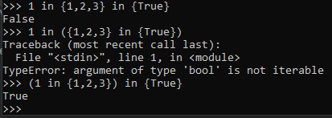

# 2-ая лабораторная по методам трансляции
### 4 вариант. Логические формулы с множествами в стиле Python
Логические формулы. Используются операции and, or, xor, not, in. \
Приоритет операций стандартный. Скобки могут использоваться для изменения приоритета. Предусмотреть возможность оператора not in. \
В качестве операндов выступают переменные с именем из одной буквы. Используйте один терминал для всех переменных. Для каждой логической операции должен быть заведен один терминал (не три ‘a’, ‘n’, ‘d’ для and). \
Пример: `(a in b) or (c not in b)`
--------------------
Т.к. невозможно получить полную копию правил, чтобы КС грамматика была LL(1), то пришлось поменять некоторые правила: \
Теперь для типов `Set` и `Bool` можно использовать все операции без возможности получить ошибку. 
Если в реальном Python нельзя использовать `Bool` вторым аргументом в операциях `in`, `not in`, а также нельзя использовать операцию `xor` между типами `Bool` и `Set`, то в этой задаче это можно делать.  
Таким образом в этой задаче нет разницы между `Set` и `Bool`.  
Всё также нельзя использовать `(not)+ not in`.

Также у операций `in` и `not in` совершенно неочевидная ассоциативность:



Поэтому будем считать эти операции неассоциативными.

Также будем выдавать ошибку за пустые скобки, а также за пустую строку (хотя на пустую строку можно выделить отдельный нетерминал).

## 1 пункт
### Построим грамматику

```
B -> E
B -> B xor E

E -> T
E -> E or T

T -> P
T -> T and P

P -> not P
P -> V in V
P -> V not in V
P -> V

V -> (B)
V -> var 
```

Избавимся от левых рекурсий и правых ветвлений:

```
B -> EB'
B' -> ε
B' -> xor EB'

E -> TE'
E' -> ε
E' -> or TE'

T -> PT'
T' -> ε
T' -> and PT'

P -> not P
P -> VP'
P' -> in V
P' -> not in V
P' -> ε

V -> (B)
V -> var 

```

Описание нетерминалов:

| Нетерминал | Описание                                |
|------------|-----------------------------------------|
| B          | Стартовый нетерминал, выражение с `xor` |
| B'         | Продолжение выражения с `xor`           |
| E          | Выражение с `or`                        |
| E'         | Продолжение выражения с `or`            |
| T          | Выражение с `and`                       |
| T'         | Продолжение выражения с `and`           |
| P          | Выражение с `not`, `in` и `not in`      |
| P'         | Продолжение выражения с `in` и `not in` |
| V          | Переменная, выражение в скобках         |


## Пункт 3

Построим множества FIRST и FOLLOW для нетерминалов нашей грамматики

| Нетерминал | FIRST      | FOLLOW                |
|------------|------------|-----------------------|
| B          | var ( not  | $ )                   |
| B'         | xor ε      | $ )                   |
| E          | var ( not  | $ ) xor               |
| E'         | or ε       | $ ) xor               |
| T          | var ( not  | $ ) xor or            |
| T'         | and ε      | $ ) xor or            |
| P          | var ( not  | $ ) xor or and        |
| P'         | not in ε   | $ ) xor or and        |
| V          | var (      | $ ) xor or and not in |
